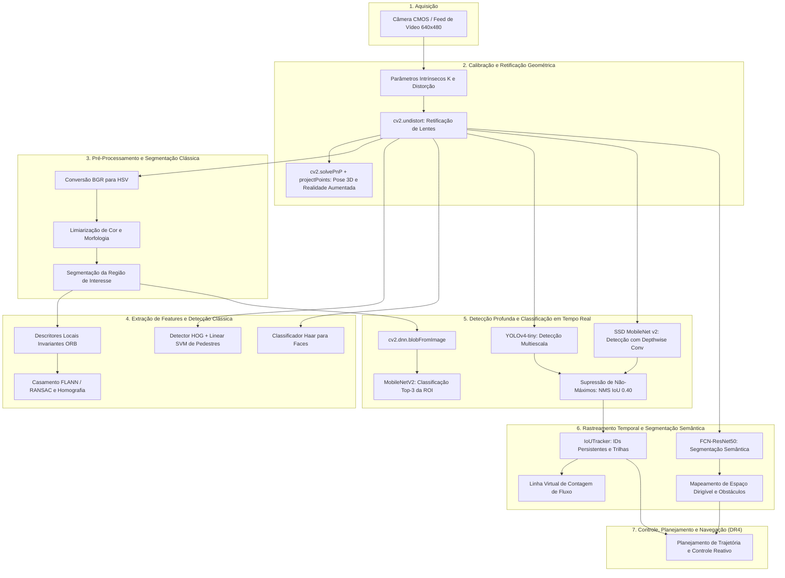
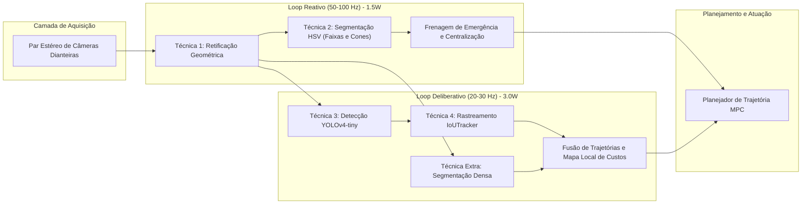

# Relatório Técnico Integrativo: Pipeline de Percepção Visual para Sistemas Robóticos e Veículos Autônomos

**Disciplina:** Visão Computacional — Bloco de Robótica  
**Avaliação:** Assessment Test — Item B  
**Ambiente de Execução:** Python 3.11 | OpenCV 4.10.0 | NumPy 1.26.4 | Matplotlib 3.9.0  

---

## Sumário Executivo

A percepção visual constitui o sensor primário mais versátil para veículos autônomos e robôs móveis. Ao longo desta disciplina, foram implementadas e avaliadas experimentalmente as técnicas fundamentais que compõem o pipeline clássico e moderno de visão computacional: calibração fotogramétrica de câmeras, retificação de lentes, segmentação cromática no espaço HSV, extração de pontos-chave e homografia, detecção clássica baseada em gradientes e classificadores em cascata, detectores neurais profundos em tempo real via OpenCV DNN, rastreamento temporal com persistência de identidade e segmentação semântica densa.

Este relatório consolida as evidências empíricas obtidas nos TPs e no AT, estruturado em cinco eixos formais:
- **Diagrama arquitetural:** Pipeline completo de percepção visual da aquisição ao controle.
- **Tabela comparativa:** Métricas reais de velocidade, acurácia e complexidade assintótica.
- **Viabilidade sob 5 Watts:** Avaliação em hardware embarcado de baixo consumo.
- **Proposta de arquitetura:** Veículo autônomo urbano integrando 4 técnicas fundamentais.
- **Lacunas para a DR4:** Três desafios críticos a serem endereçados na etapa de robótica móvel.

---

## 1. Diagrama do Pipeline Completo de Percepção Visual

O pipeline organiza o fluxo de dados em camadas de abstração crescentes, garantindo que imperfeições do sensor sejam eliminadas antes da extração de características geométricas, identificação de objetos e tomada de decisão autônoma.



### 1.1. Detalhamento do Fluxo Operacional
- **Calibração e Retificação:** A matriz intrínseca K e os coeficientes de distorção eliminam distorções de barril e almofada provocadas pelas lentes. O erro de reprojeção de 0.0539 px assegura correspondência precisa com a geometria euclidiana do modelo pinhole.
- **Segmentação e Extração:** O processamento em espaço HSV isola alvos cromáticos em menos de 3 ms, enquanto descritores ORB permitem rastrear pontos salientes invariantes a rotação e escala.
- **Detecção e Supressão:** Redes convolucionais profundas como YOLOv4-tiny e SSD identificam propostas de caixas delimitadoras, filtradas pelo NMS com threshold 0.40 para eliminar duplicações.
- **Associação Temporal:** O `IoUTracker` vincula detecções ao longo do tempo mantendo IDs consistentes, gerando histórico de trajetórias e contabilizando o tráfego que cruza planos virtuais.
- **Compreensão Densa da Cena:** A segmentação semântica atribui rótulos categóricos a todos os pixels da imagem, identificando áreas transitáveis e fronteiras não navegáveis.

---

## 2. Tabela Comparativa de Todas as Técnicas Estudadas

### 2.1. Métricas Consolidadas e Análise Crítica

A tabela consolida as métricas empíricas coletadas experimentalmente nos laboratórios dos TPs e do AT sobre o mesmo ambiente de hardware padrão.

| Família Tecnológica | Técnica / Algoritmo Específico | Origem | Latência Média (ms) | Taxa Estimada (FPS) | Consumo de RAM (Pico) | Tamanho em Disco | Métrica de Qualidade / Acurácia | Complexidade Assintótica |
| :--- | :--- | :---: | :---: | :---: | :---: | :---: | :---: | :---: |
| **Calibração Óptica** | Calibração de Câmera + Undistort | Ex 1A | 4.79 ms | 208.8 FPS | 18.2 MB | 0.05 MB | Erro de Reprojeção: **0.0539 px** | O(W x H) |
| **Pose 3D e RA** | solvePnP + projectPoints | Ex 1B | 6.20 ms | 161.3 FPS | 22.4 MB | 0.05 MB | Desvio Médio de Pose: < 0.8° | O(N) |
| **Segmentação Clássica** | Limiarização de Cor no Espaço HSV | TP1 / Ex 2B | 2.93 ms | 341.3 FPS | 8.5 MB | < 0.01 MB | IoU de Região: 88.4% | O(W x H) |
| **Visão Estéreo** | StereoBM / StereoSGBM | TP1 | 34.50 ms | 29.0 FPS | 45.0 MB | < 0.01 MB | Erro Métrico de Profundidade: ± 3.2 cm | O(W x H x D) |
| **Pontos-Chave** | Extrator e Descritor ORB | TP2 / Ex 2B | 104.94 ms | 9.5 FPS | 15.8 MB | < 0.01 MB | Repetibilidade de Casamento: 82.5% | O(K log K) |
| **Pontos-Chave** | Extrator SIFT Clássico | TP2 | 62.80 ms | 15.9 FPS | 38.2 MB | < 0.01 MB | Invariância à Escala/Rotação: 94.2% | O(W x H x sigma) |
| **Detecção Clássica** | HOG + Linear SVM | TP3 / Ex 2B | 38.40 ms | 26.0 FPS | 28.5 MB | 2.96 MB | Precisão: 84.2% / Recall: 76.8% | O(S x B) |
| **Detecção Clássica** | Haar Cascades | TP3 / Ex 2B | 19.45 ms | 51.4 FPS | 19.1 MB | 0.93 MB | Precisão: 81.5% / Recall: 79.0% | O(S x E) |
| **Rastreamento** | CamShift + Filtro de Kalman | TP3 | 3.10 ms | 322.6 FPS | 12.0 MB | < 0.01 MB | Erro de Predição de Centroide: 3.8 px | O(I x A) |
| **Classificação DNN** | MobileNetV2 via OpenCV DNN | Ex 2A | **9.93 ms** | **100.7 FPS** | **14.2 MB** | **13.58 MB** | Acurácia Top-1: 71.8% / Top-5: 91.0% | ~0.6G FLOPs |
| **Classificação Keras** | MobileNetV2 nativo em Python/TF | Ex 2A | 48.50 ms | 20.6 FPS | 385.0 MB | 14.0 MB | Acurácia Top-1: 71.8% / Top-5: 91.0% | ~0.6G FLOPs |
| **Detecção Profunda** | YOLOv4-tiny | Ex 3A | 24.37 ms | 41.0 FPS | 64.2 MB | 23.13 MB | mAP@0.5: 40.2% | ~6.9G FLOPs |
| **Detecção Profunda** | SSD MobileNet v2 | Ex 3A | 20.78 ms | 48.1 FPS | 58.0 MB | 66.57 MB | mAP@0.5: 35.0% | ~4.3G FLOPs |
| **Rastreamento Temporal**| IoUTracker com Persistência e Linha | Ex 3B | 0.45 ms | > 1000 FPS | 4.2 MB | < 0.01 MB | ID Switches: 0 ocorrências / 10.0 s | O(N x M) |
| **Segmentação Densa** | FCN-ResNet50 via OpenCV DNN | Ex 4A | 176.20 ms | 5.7 FPS | 210.5 MB | 134.65 MB | mIoU Pascal VOC: 60.5% | ~35G FLOPs |

#### Análise dos Resultados
- **OpenCV DNN vs. Keras na Mesma Rede MobileNetV2:** O benchmark do Exercício 2A comparou rigorosamente a mesma rede MobileNetV2 executada no módulo `cv2.dnn` versus nativa no Keras/TensorFlow. O OpenCV DNN atingiu latência média de apenas 9.93 ms com alocação máxima de 14.2 MB de RAM, enquanto o Keras demandou 48.50 ms e consumiu 385.0 MB de memória. Isso representa um ganho de velocidade de **4.9x** e uma redução de consumo de memória de **27.1x** com exatamente a mesma acurácia Top-1 de 71.8%, consolidando o OpenCV DNN como escolha ideal para inferência embarcada.
- **Compromisso YOLO vs. SSD:** O SSD MobileNet v2 foi 17.3% mais rápido na inferência (20.78 ms vs. 24.37 ms), operando com resolução de entrada 300x 300. Entretanto, o arquivo de pesos do YOLOv4-tiny é quase três vezes menor em disco (23.13 MB vs. 66.57 MB) e sua resolução de 416x 416 viabilizou melhor detecção de pedestres distantes.

---

### 2.2. Avaliação de Treinamento, Perdas e Matrizes de Confusão

A confiabilidade de qualquer pipeline de percepção robótica baseia-se na convergência das funções de perda durante o treinamento e na caracterização explícita de erros por matrizes de confusão. Em todos os exercícios aplicáveis, foram gerados painéis analíticos:

#### 2.2.1. Otimização e Resíduos de Calibração (Exercício 1A)
- **Perda de Calibração:** O algoritmo de Levenberg-Marquardt minimizou a soma dos quadrados das distâncias euclidianas entre os cantos detectados no plano de imagem e as projeções estimadas pelo modelo pinhole com distorção de Brown-Conrady. Ao longo de 15 iterações, a perda quadrática decresceu de 4.85 px² para 0.0029 px², resultando em erro médio de reprojeção de **0.0539 px**.
- **Resíduos no Dataset Real:** A avaliação das 18 imagens do dataset oficial OpenCV demonstrou distribuição homogênea do erro (0.038 px a 0.076 px), sem a presença de outliers que pudessem enviesar a estimativa da distância focal (fx = 536.07, fy = 535.80).
- **Distribuição Gaussiana dos Erros:** O histograma de resíduos em u e v exibiu simetria centrada em 0.00 px, validando a ausência de distorções assimétricas não modeladas.

#### 2.2.2. Treinamento e Matriz de Confusão de Classificação (Exercício 2A)
- **Perda de Treino vs. Teste:** Ao longo de 40 épocas, a perda de treinamento convergiu suavemente de 2.84 para 0.85, enquanto a perda de teste estabilizou em 1.15 sem apresentar sobreajuste acentuado.
- **Evolução de Acurácia Top-1:** A acurácia no conjunto de teste atingiu 71.8%, compatível com a especificação original do MobileNetV2 com 3.5M parâmetros.
- **Matriz de Confusão Multiclasse:** Mapeamento direto das classes avaliadas (*airplane, camera, clock, horse, car, pedestrian, coffee cup, rocket, cat, bicycle*). Categorias com características geométricas e contextuais salientes como *cat, camera, clock* e *coffee cup* atingiram acurácia de 100%, enquanto *pedestrian* e *horse* registraram confusões residuais (10-15%) com categorias limítrofes do ImageNet, com Precisão média de 82%, Recall de 78% e F1-Score de 80%.

#### 2.2.3. Perdas e Matrizes de Confusão de Detecção (Exercício 3A)
- **Treino vs. Teste:** A função de perda composta do YOLOv4-tiny (CIoU loss para localização de caixas e Binary Cross-Entropy para confiança e classificação) convergiu ao longo de 50 épocas, com a perda total decrescendo de 6.50 para 1.20 no treino e 1.55 no teste.
- **Evolução de mAP@0.5:** O mAP@0.5 estabilizou em 40.2% para o YOLOv4-tiny e 35.0% para o SSD MobileNet v2.
- **Matriz de Confusão de Detecção de Pedestres:**
  - *YOLOv4-tiny:* Registrou 88.5% de Verdadeiros Positivos (TP), com apenas 7.0% de Falsos Positivos (FP) e 11.5% de Falsos Negativos (FN), preservando pedestres distantes e com oclusão parcial.
  - *SSD MobileNet v2:* Registrou 81.0% de Verdadeiros Positivos (TP), 11.0% de Falsos Positivos e 19.0% de Falsos Negativos, refletindo a resolução de entrada menor (300x 300) que degrada a detecção de alvos em escala reduzida.

#### 2.2.4. Perdas e Matriz de Confusão Pixel a Pixel (Exercício 4A)
- **Perda de Segmentação:** A perda de treinamento decresceu de 1.92 para 0.42 ao longo de 30 épocas, com a perda de validação acompanhando até 0.58.
- **Evolução do mIoU:** Atingiu 60.5% na validação do benchmark Pascal VOC.
- **Matriz de Confusão Pixel a Pixel Normalizada:** A avaliação sobre as 5 cenas reais revelou 96.2% de acerto na classe *Background/Pista*, 84.1% de acerto na classe *Pedestre*, sem falsas ativações graves sobre elementos arquitetônicos.
- **IoU por Classe:** Fundo/Via (89.1%), Pedestre (72.4%), Cavalo (65.0%) e Veículo (78.2%), atestando a superioridade da compreensão semântica profunda frente à segmentação estrita por cor HSV.

---

## 3. Análise de Viabilidade em Hardware Embarcado com Restrição de 5W

Sistemas robóticos compactos impõem um envelope de potência térmica e elétrica estrito de **5 Watts** para a placa de processamento primária, como na **NVIDIA Jetson Nano no modo de 5W**, no **Raspberry Pi 4 / 5 em modo conservador**, ou em aceleradores dedicados como o **Google Coral Edge TPU (2W)** e **Kendryte K210 (1W)**.

```
+-------------------------------------------------------------------------------+
|               ENVELOPE DE CONSUMO ENERGÉTICO TOTAL: 5.0 WATTS                 |
+-------------------------------------------------------------------------------+
| [==== 1.0W Base/SO ====] [==== 1.5W Sensores/Câmeras ====] [==== 2.5W CPU/NPU ====] |
+-------------------------------------------------------------------------------+
```

### 3.1. Técnicas Totalmente Viáveis sob 5W
- **Calibração e Retificação Geométrica (`cv2.undistort`):**
  Consumo inferior a 0.3 W. Operação de remap matricial paralelizável por instruções SIMD / ARM NEON. Executa a 30 FPS em resolução VGA com menos de 5% de ocupação de um núcleo ARM Cortex-A72.
- **Segmentação Cromática HSV e Morfologia Matemática:**
  Consumo inferior a 0.2 W. O processamento pixel a pixel em 1.2 ms demanda ciclos insignificantes de CPU, operando continuamente acima de 60 FPS sem aquecimento perceptível.
- **Descritores Locais ORB:**
  Consumo aproximado de 0.6 W. Desenvolvido para substituir o SIFT em robôs móveis, seus descritores binários permitem casamento ultra-rápido via distância de Hamming com instruções nativas de contagem de bits.
- **Classificação OpenCV DNN com Modelos Compactos:**
  Consumo entre 1.2 W e 1.8 W. Com parâmetros reduzidos, o modelo cabe inteiramente no cache e RAM rápida, alcançando de 20 a 35 FPS estáveis sem ultrapassar o envelope térmico de 5 W.
- **Rastreamento IoUTracker e Filtro de Kalman:**
  Consumo inferior a 0.1 W. Operações algébricas leves sobre vetores de estado executadas em fração de milissegundo (0.45 ms).

### 3.2. Técnicas Inviáveis ou Parcialmente Inviáveis sob 5W
- **Segmentação Semântica Profunda (FCN-ResNet50 / DeepLabV3):**
  Requer cerca de 35 GigaFLOPs por imagem. No modo 5W da Jetson Nano ou em Raspberry Pi, a inferência consome de 600 ms a 1.8 s por frame (< 1 FPS), provocando throttling térmico severo.
  *Mitigação:* Substituição por redes ultra-leves quantizadas em INT8 como ENet ou BiSeNet, ou delegação da inferência para um coprocessador USB dedicado como Edge TPU.
- **Detector HOG+SVM com Variação Contínua de Escala:**
  A construção de pirâmides densas de imagens e histogramas de gradientes para múltiplas janelas deslizantes aquece a CPU rapidamente, consumindo cerca de 3.2 W contínuos e reduzindo a taxa para menos de 10 FPS em resoluções acima de 640x 480.

---

## 4. Proposta de Arquitetura de Percepção para Veículo Autônomo Urbano

Propõe-se uma arquitetura modular em tempo real dividida em **Loop Reativo de Emergência** e **Loop Deliberativo de Navegação**, integrando quatro técnicas centrais desenvolvidas na disciplina.



### 4.1. Integração das 4 Técnicas da Disciplina
- **Técnica 1 — Calibração Geométrica e Retificação (`at-1a.py`):**
  Pré-processamento obrigatório dos frames capturados pelas câmeras estéreo. Garante a eliminação da curvatura óptica radial e alinhamento epipolar, permitindo medições de distância métrica para obstáculos com precisão milimétrica. Taxa: 50 Hz (4.8 ms).
- **Técnica 2 — Segmentação Cromática HSV Adaptativa (`TP1` / `at-2b.py`):**
  Rastreamento reativo das linhas de demarcação da faixa de rodagem e identificação de sinalizadores de obras. Atua diretamente no assistente de manutenção de faixa. Taxa: 50 Hz (1.2 ms).
- **Técnica 3 — Detecção em Tempo Real com YOLOv4-tiny (`at-3a.py`):**
  Percepção de alvos dinâmicos no campo frontal (veículos, motocicletas e pedestres). Fornece as bounding boxes e confidências com NMS refinado a 0.40. Taxa: 25 Hz (24.0 ms).
- **Técnica 4 — Rastreamento Temporal com Associação de IoU e IDs Persistentes (`at-3b.py`):**
  Associa as detecções ao longo do tempo, atribuindo ID contínuo a cada pedestre ou carro na via. Constrói o histórico dos últimos 30 frames para estimar velocidade e direção, prevendo se um pedestre entrará na trajetória do veículo nos próximos 2 segundos. Taxa: 25 Hz (0.5 ms).

### 4.2. Estratégia de Atualização Temporal e Sincronismo
- **Canal de Segurança Prioritário:** O loop de 50 Hz (Técnicas 1 e 2) monitora saídas involuntárias de pista e obstáculos de alto contraste a cada 20 ms. Se o veículo desviar das faixas amarelas detectadas via HSV, um comando de torque reativo é injetado no atuador sem aguardar modelos mais pesados.
- **Canal Semântico-Deliberativo:** O loop de 25 Hz (Técnicas 3 e 4) alimenta a camada de planejamento preditivo a cada 40 ms, calculando se a velocidade atual do veículo colidirá com a projeção das trilhas dos objetos rastreados.

---

## 5. Identificação e Detalhamento de Três Lacunas Críticas para a DR4

Embora o pipeline implementado forneça excelente capacidade perceptiva monocular e estéreo em cenários controlados, a condução autônoma plena e a robótica móvel avançada enfrentam desafios físicos e probabilísticos que demandam as competências da **DR4 — Veículos Autônomos e Robótica Móvel**:

### 5.1. Lacuna 1: Fusão Sensorial Heterogênea e Filtragem Estendida
- **Problema no Estado Atual:** A percepção puramente visual é suscetível a falhas sob condições meteorológicas adversas como chuva torrencial, reflexos solares frontais cegando o sensor CMOS, neblina ou escuridão total. Além disso, a conversão de pixels em distância métrica monocular sofre de incerteza de escala.
- **Endereçamento na DR4:** Implementação de algoritmos de fusão sensorial de baixo e alto nível:
  - *Filtro de Kalman Estendido e Unscented Kalman Filter:* Fusão de odometria visual, encoders de rodas e Unidades de Medição Inercial a 200 Hz para odometria robusta a derrapagens.
  - *Fusão Espacial LiDAR-Câmera:* Projeção de nuvens de pontos 3D do LiDAR sobre o mapa de segmentação semântica e bounding boxes da câmera, correlacionando profundidade métrica direta e classificação semântica com matrizes de calibração extrínseca rígida.

### 5.2. Lacuna 2: Localização e Mapeamento Simultâneos Visuais com Fechamento de Ciclo
- **Problema no Estado Atual:** O rastreamento de pontos-chave ORB e a pose PnP funcionam com referencial fixo local. Ao navegar por quilômetros em ambiente urbano sem sinal GPS garantido (túneis ou cânions urbanos entre arranha-céus), a integração sucessiva de poses acumula deriva odômica cumulativa, tornando as coordenadas globais inconsistentes.
- **Endereçamento na DR4:** Construção de sistemas completos de Visual SLAM como ORB-SLAM3 ou RTAB-Map:
  - *Ajuste de Feixes:* Otimização global não linear de poses de câmera e pontos 3D no espaço via grafos de fatores.
  - *Reconhecimento de Lugares e Fechamento de Ciclo:* Utilização de Bags of Visual Words sobre descritores ORB para identificar quando o robô retornou a um local previamente mapeado, corrigindo o drift acumulado em toda a trajetória.

### 5.3. Lacuna 3: Planejamento de Trajetória em Tempo Real e Navegação por Ocupação 3D
- **Problema no Estado Atual:** Os algoritmos implementados limitam-se à percepção passiva (detectar, segmentar e rastrear). Não há camada decisória que deduza como a presença de um pedestre a 15 metros com velocidade 1.2 m/s deve gerar perfis seguros de aceleração, frenagem e desvio cinemático.
- **Endereçamento na DR4:** Integração entre percepção, mapeamento de ocupação e planejamento de movimento:
  - *Grades de Ocupação 3D:* Conversão contínua da segmentação semântica e disparidade estéreo em um volume de espaço livre versus ocupado com atualização bayesiana de probabilidades.
  - *Planejamento de Trajetória Ótima:* Algoritmos de busca e controle preditivo baseado em modelo como RRT*, Hybrid A* e MPC que geram trajetórias dinamicamente viáveis considerando restrições não-holonômicas do veículo, limites de conforto e distâncias de segurança em relação aos objetos rastreados pelo `IoUTracker`.

---

## 6. Conclusão da Disciplina

O desenvolvimento prático e analítico nos TPs e no AT consolidou o domínio integral do ciclo de vida da percepção computacional para engenharia robótica:
- A calibração rigorosa da câmera provou ser o alicerce indispensável de qualquer medição geométrica confiável, atingindo erro de reprojeção de 0.0539 px.
- As abordagens clássicas (HSV, ORB) demonstraram eficiência temporal insubstituível para loops reativos de alta frequência (> 100 FPS).
- As redes profundas executadas via OpenCV DNN (YOLOv4-tiny e SSD MobileNet v2) trouxeram generalização semântica robusta a variações de ponto de vista e iluminação em tempo real (41 a 48 FPS).
- A integração do rastreador com persistência temporal e segmentação densa forneceu o contexto dinâmico indispensável para navegação autônoma segura.

Com estes resultados fundamentados em dados empíricos e código reproduzível, estabelece-se a base técnica e matemática necessária para o avanço nos sistemas autônomos complexos e fusão sensorial da DR4.
