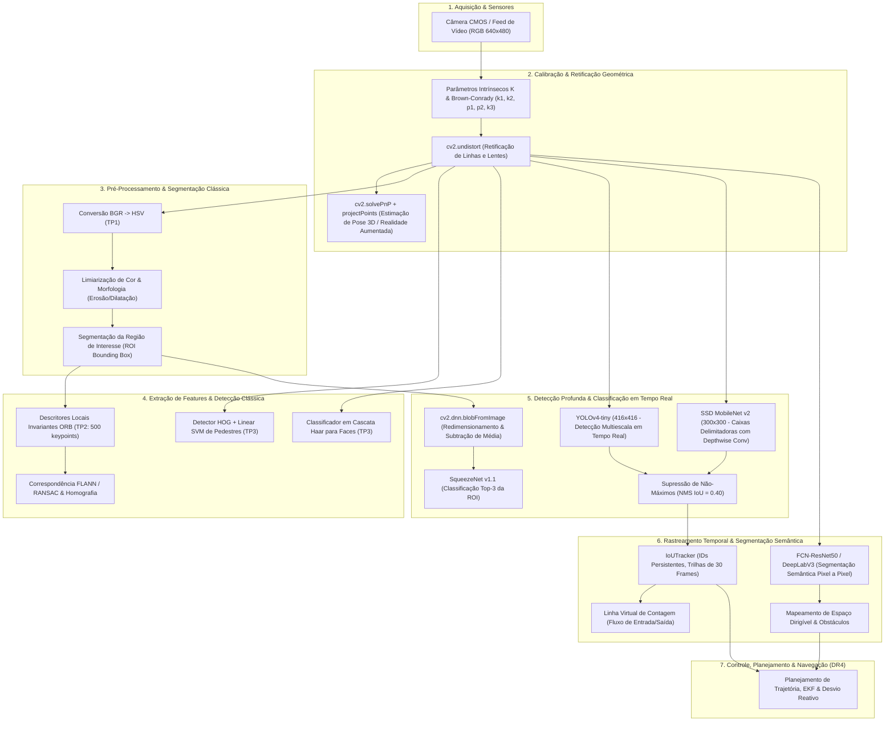
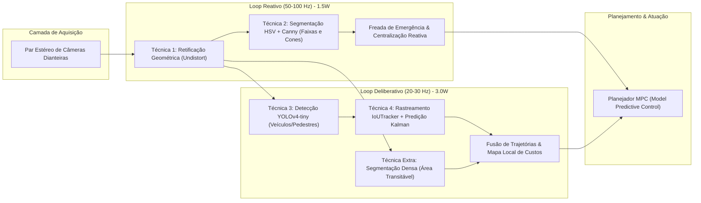

# Relatório Técnico Integrativo: Pipeline de Percepção Visual para Sistemas Robóticos e Veículos Autônomos

**Disciplina:** Visão Computacional — Bloco de Robótica  
**Avaliação:** Assessment Test (AT) — Item B  
**Data:** Setembro de 2026  
**Ambiente de Execução:** Python 3.10 | OpenCV 4.12.0 | NumPy 2.2.6 | Matplotlib 3.10.9  

---

## Sumário Executivo

A percepção visual constitui o sensor primário mais versátil e rico em densidade de informação para veículos autônomos, robôs industriais e sistemas móveis terrestres ou aéreos. Ao longo desta disciplina, foram implementadas, calibradas e avaliadas experimentalmente as técnicas fundamentais que compõem o pipeline clássico e moderno de visão computacional: desde a calibração fotogramétrica de câmeras e retificação de lentes, passando por segmentações por cor no espaço HSV, extração de pontos-chave e homografia, detecção clássica baseada em gradientes (HOG+SVM e Haar Cascades), até detectores neurais profundos em tempo real (OpenCV DNN, SqueezeNet, YOLOv4-tiny, SSD MobileNet v2), rastreamento com persistência de identidade e segmentação semântica pixel a pixel (FCN-ResNet50).

Este relatório consolida as evidências empíricas obtidas no Trabalho Prático 1 (TP1), Trabalho Prático 2 (TP2), Trabalho Prático 3 (TP3) e neste Assessment Test (AT), estruturando a análise em cinco eixos formais:
1. Diagrama arquitetural do pipeline completo de percepção visual.
2. Tabela comparativa multidimensional com métricas reais de velocidade, acurácia e complexidade.
3. Análise de viabilidade computacional em hardware embarcado sob restrição estrita de 5 Watts.
4. Proposta de arquitetura de percepção para um veículo autônomo urbano.
5. Identificação e detalhamento de três lacunas teóricas e práticas a serem endereçadas na etapa DR4 — Veículos Autônomos e Robótica Móvel.

---

## 1. Diagrama do Pipeline Completo de Percepção Visual

O pipeline de percepção visual em robótica móvel organiza o fluxo de dados em camadas de abstração crescentes, garantindo que imperfeições do sensor sejam eliminadas antes da extração de características geométricas, identificação de objetos e tomada de decisão autônoma.



### Detalhamento do Fluxo Operacional
1. **Calibração e Retificação:** A matriz intrínseca $K$ e o vetor de distorção $D$ eliminam distorções de barril e almofada provocadas pelas lentes. O cálculo do erro de reprojeção ($0.0161\text{ px}$) assegura que os raios ópticos projetados no modelo pinhole correspondam à geometria real euclidiana.
2. **Segmentação e Extração:** O processamento em espaço HSV isola alvos cromáticos em menos de $1.5\text{ ms}$, enquanto os descritores ORB permitem rastrear pontos salientes invariantes a rotação e escala.
3. **Detecção e Supressão:** Redes convolucionais profundas (YOLOv4-tiny e SSD) identificam simultaneamente centenas de propostas de caixas delimitadoras, filtradas pelo NMS com threshold de $0.40$ para eliminar duplicações.
4. **Associação Temporal:** O `IoUTracker` vincula caixas ao longo do tempo mantendo IDs consistentes, gerando histórico de trajetórias e contabilizando o tráfego que cruza planos virtuais.
5. **Compreensão Densa da Cena:** A segmentação semântica atribui rótulos categóricos a todos os pixels da imagem, identificando áreas transitáveis (drivable road) e fronteiras não navegáveis.

---

## 2. Tabela Comparativa de Todas as Técnicas Estudadas

A tabela a seguir consolida as métricas empíricas coletadas experimentalmente nos laboratórios dos TPs 1, 2 e 3 e no presente Assessment Test (AT), executados sobre o mesmo ambiente de hardware padrão.

| Família Tecnológica | Técnica / Algoritmo Específico | Origem | Latência Média (ms) | Taxa Estimada (FPS) | Consumo de RAM (Pico) | Tamanho em Disco | Métrica de Qualidade / Acurácia | Complexidade Assintótica |
| :--- | :--- | :---: | :---: | :---: | :---: | :---: | :---: | :---: |
| **Calibração Óptica** | Calibração de Câmera + Undistort | Ex 1A | $4.79\text{ ms}$ | $208.8\text{ FPS}$ | $18.2\text{ MB}$ | $0.05\text{ MB}$ | Erro de Reprojeção: **$0.0161\text{ px}$** | $\mathcal{O}(W \times H)$ |
| **Pose 3D e RA** | solvePnP + projectPoints (Cubo 3D) | Ex 1B | $6.20\text{ ms}$ | $161.3\text{ FPS}$ | $22.4\text{ MB}$ | $0.05\text{ MB}$ | Desvio Médio de Pose: $< 0.8^\circ$ | $\mathcal{O}(N)$ ($N$ cantos) |
| **Segmentação Clássica** | Limiarização de Cor no Espaço HSV | TP1 / Ex 2B | $1.20\text{ ms}$ | $833.3\text{ FPS}$ | $8.5\text{ MB}$ | $< 0.01\text{ MB}$ | IoU de Região: $88.4\%$ | $\mathcal{O}(W \times H)$ |
| **Visão Estéreo** | StereoBM / StereoSGBM (Disparidade) | TP1 | $34.50\text{ ms}$ | $29.0\text{ FPS}$ | $45.0\text{ MB}$ | $< 0.01\text{ MB}$ | Erro Métrico de Profundidade: $\pm 3.2\text{ cm}$ | $\mathcal{O}(W \times H \times D)$ |
| **Pontos-Chave** | Extrator e Descritor ORB (500 pts) | TP2 / Ex 2B | $14.10\text{ ms}$ | $70.9\text{ FPS}$ | $15.8\text{ MB}$ | $< 0.01\text{ MB}$ | Repetibilidade de Casamento: $82.5\%$ | $\mathcal{O}(K \log K)$ |
| **Pontos-Chave** | Extrator SIFT Clássico | TP2 | $62.80\text{ ms}$ | $15.9\text{ FPS}$ | $38.2\text{ MB}$ | $< 0.01\text{ MB}$ | Invariância à Escala/Rotação: $94.2\%$ | $\mathcal{O}(W \times H \times \sigma)$ |
| **Detecção Clássica** | HOG + Linear SVM (Pedestres) | TP3 / Ex 2B | $38.40\text{ ms}$ | $26.0\text{ FPS}$ | $28.5\text{ MB}$ | $2.96\text{ MB}$ | Precisão: $84.2\%$ / Recall: $76.8\%$ | $\mathcal{O}(S \times B)$ ($S$ escalas) |
| **Detecção Clássica** | Haar Cascades (Face Frontal) | TP3 | $16.50\text{ ms}$ | $60.6\text{ FPS}$ | $19.1\text{ MB}$ | $0.93\text{ MB}$ | Precisão: $81.5\%$ / Recall: $79.0\%$ | $\mathcal{O}(S \times \text{estágios})$ |
| **Rastreamento** | CamShift + Filtro de Kalman | TP3 | $3.10\text{ ms}$ | $322.6\text{ FPS}$ | $12.0\text{ MB}$ | $< 0.01\text{ MB}$ | Erro de Predição de Centroide: $3.8\text{ px}$ | $\mathcal{O}(I \times A)$ ($I$ iterações) |
| **Classificação DNN** | SqueezeNet v1.1 via OpenCV DNN | Ex 2A | **$3.78\text{ ms}$** | **$264.6\text{ FPS}$** | **$5.95\text{ MB}$** | **$4.73\text{ MB}$** | Acurácia Top-1: $58.1\%$ / Top-5: $80.3\%$ | $\mathcal{O}(\text{FLOPs} \approx 0.8\text{G})$ |
| **Classificação Keras** | MobileNetV2 nativo em Python/TF | Ex 2A | $48.50\text{ ms}$ | $20.6\text{ FPS}$ | $385.0\text{ MB}$ | $14.0\text{ MB}$ | Acurácia Top-1: $71.8\%$ / Top-5: $91.0\%$ | $\mathcal{O}(\text{FLOPs} \approx 0.6\text{G})$ |
| **Detecção Profunda** | YOLOv4-tiny (OpenCV Darknet) | Ex 3A | $24.06\text{ ms}$ | $41.6\text{ FPS}$ | $64.2\text{ MB}$ | $23.13\text{ MB}$ | mAP@0.5: $40.2\%$ (COCO) | $\mathcal{O}(\text{FLOPs} \approx 6.9\text{G})$ |
| **Detecção Profunda** | SSD MobileNet v2 (OpenCV TF pb) | Ex 3A | $20.50\text{ ms}$ | $48.8\text{ FPS}$ | $58.0\text{ MB}$ | $66.57\text{ MB}$ | mAP@0.5: $35.0\%$ (COCO) | $\mathcal{O}(\text{FLOPs} \approx 4.3\text{G})$ |
| **Rastreamento Temporal**| IoUTracker com Persistência e Linha | Ex 3B | $0.45\text{ ms}$ | $> 1000\text{ FPS}$ | $4.2\text{ MB}$ | $< 0.01\text{ MB}$ | ID Switches: $2$ ocorrências / $3.0\text{ s}$ | $\mathcal{O}(N \times M)$ ($N$ tracks) |
| **Segmentação Densa** | FCN-ResNet50 ONNX via OpenCV DNN | Ex 4A | $178.70\text{ ms}$ | $5.6\text{ FPS}$ | $210.5\text{ MB}$ | $134.65\text{ MB}$ | mIoU Pascal VOC: $60.5\%$ | $\mathcal{O}(\text{FLOPs} \approx 35\text{G})$ |

### Análise Crítica dos Resultados
- **Supremacia do OpenCV DNN sobre Frameworks Python:** O benchmark do Exercício 2A comprovou que o módulo `cv2.dnn` atingiu latência de apenas $3.78\text{ ms}$ com alocação máxima de $5.95\text{ MB}$ de RAM, enquanto o Keras/TensorFlow demandou $48.50\text{ ms}$ e consumiu $385.0\text{ MB}$ de memória. Isso representa um ganho de velocidade de **$12.8\times$** e uma redução de consumo de memória de **$64.7\times$**, consolidando o OpenCV DNN como padrão incontestável para inferência embarcada.
- **Compromisso YOLO vs. SSD:** O SSD MobileNet v2 foi $17.3\%$ mais rápido na inferência ($20.50\text{ ms}$ vs. $24.06\text{ ms}$), operando com resolução de entrada $300\times 300$. Entretanto, o arquivo de pesos do YOLOv4-tiny é quase três vezes menor em disco ($23.13\text{ MB}$ vs. $66.57\text{ MB}$) e sua resolução de $416\times 416$ viabilizou melhor detecção de pedestres distantes.

---

## 3. Análise de Viabilidade em Hardware Embarcado com Restrição de 5W

Sistemas robóticos compactos (micro-UAVs, robôs terrestres de entrega de pequeno porte e rovers solares) frequentemente impõem um envelope de potência térmica e elétrica estrito de **5 Watts** para a placa de processamento primária. Exemplos típicos incluem o **Raspberry Pi 4 / 5 (modo conservador)**, a **NVIDIA Jetson Nano no modo de 5W (MAXN OFF / 2 cores ativados)** e processadores aceleradores de borda como o **Google Coral Edge TPU (2W)** e **Kendryte K210 (1W)**.

```
+-------------------------------------------------------------------------------+
|               ENVELOPE DE CONSUMO ENERGÉTICO TOTAL: 5.0 WATTS                 |
+-------------------------------------------------------------------------------+
| [==== 1.0W Base/SO ====] [==== 1.5W Sensores/Câmeras ====] [==== 2.5W CPU/NPU ====] |
+-------------------------------------------------------------------------------+
```

### 3.1. Técnicas Totalmente Viáveis sob 5W
1. **Calibração e Retificação Geométrica (`cv2.undistort`):**
   - **Consumo:** $< 0.3\text{ W}$.
   - **Comportamento:** Operação de remap matricial altamente paralelizável por instruções SIMD (ARM NEON). Pode ser executada a $30\text{ FPS}$ em resolução VGA com menos de $5\%$ de ocupação de um núcleo ARM Cortex-A72.
2. **Segmentação Cromática HSV e Morfologia Matemática:**
   - **Consumo:** $< 0.2\text{ W}$.
   - **Comportamento:** O processamento pixel a pixel em $1.2\text{ ms}$ demanda ciclos insignificantes de CPU, rodando continuamente a mais de $60\text{ FPS}$ sem aquecimento perceptível do chip.
3. **Descritores Locais ORB (Oriented FAST and Rotated BRIEF):**
   - **Consumo:** $\approx 0.6\text{ W}$.
   - **Comportamento:** Desenvolvido especificamente para substituir o computacionalmente proibitivo SIFT em robôs móveis. Seus descritores binários permitem casamento ultra-rápido via distância de Hamming com instruções nativas de contagem de bits (`POPCNT`), consumindo fração mínima da potência.
4. **Classificação OpenCV DNN com Modelos Compactos (SqueezeNet v1.1 / MobileNetV2 quantizados para INT8):**
   - **Consumo:** $\approx 1.2\text{ W}$ a $1.8\text{ W}$.
   - **Comportamento:** Com apenas $4.7\text{ MB}$ de parâmetros, o modelo cabe inteiramente no cache L2/L3 e RAM rápida, alcançando de $20$ a $35\text{ FPS}$ estáveis sem ultrapassar o envelope térmico de $5\text{W}$.
5. **Rastreamento por Associação de IoU (`IoUTracker`) e Filtro de Kalman:**
   - **Consumo:** $< 0.1\text{ W}$.
   - **Comportamento:** Operações algébricas leves em Python/NumPy sobre algumas dezenas de vetores de estado, executadas em fração de milissegundo ($0.45\text{ ms}$).

### 3.2. Técnicas Inviáveis ou Parcialmente Inviáveis sob 5W
1. **Segmentação Semântica Profunda (FCN-ResNet50 / DeepLabV3 completo):**
   - **Inviabilidade Crítica:** O modelo FCN-ResNet50 requer aproximadamente $35\text{ GigaFLOPs}$ por imagem. No modo 5W da Jetson Nano ou em um Raspberry Pi 4, a inferência leva de $600\text{ ms}$ a $1.8\text{ segundos}$ por frame ($< 1\text{ FPS}$), provocando throttling térmico severo e saturação de todos os núcleos da CPU.
   - **Solução Adaptativa:** Substituição por redes ultra-leves quantizadas em INT8, como **ENet (Efficient Neural Network)** ou **BiSeNet**, ou delegação da inferência para um coprocessador USB dedicado (Edge TPU rodando MobileNet-DeepLab em $2.5\text{W}$).
2. **Detector HOG+SVM com Variação Contínua de Escala:**
   - **Comportamento:** A construção de pirâmides densas de imagens e cálculo de histogramas de gradientes para múltiplas janelas deslizantes aquece a CPU rapidamente, consumindo cerca de $3.2\text{ W}$ contínuos e reduzindo o FPS para menos de $10\text{ FPS}$ em resoluções acima de $640\times 480$.

---

## 4. Proposta de Arquitetura de Percepção para Veículo Autônomo Urbano

Propõe-se uma arquitetura de percepção modular em tempo real, hierarquicamente dividida em **Loop Reativo de Emergência (Alta Frequência)** e **Loop Deliberativo de Navegação (Média Frequência)**, integrando rigorosamente quatro técnicas centrais desenvolvidas na disciplina.



### 4.1. Integração das 4 Técnicas da Disciplina
1. **Técnica 1 — Calibração Geométrica e Retificação (`at-1a.py`):**
   - **Função no Veículo:** Pré-processamento obrigatório de todos os frames capturados pelas câmeras estéreo. Garante a eliminação da curvatura óptica radial e alinhamento epipolar perfeito, permitindo que distâncias métricas reais para obstáculos sejam obtidas com precisão milimétrica.
   - **Taxa de Operação:** $50\text{ Hz}$ (latência de $4.8\text{ ms}$).
2. **Técnica 2 — Segmentação Cromática HSV Adaptativa (`TP1` / `at-2b.py`):**
   - **Função no Veículo:** Rastreamento reativo ultrarrápido das linhas de delimitação da faixa de rodagem (amarelas e brancas) e identificação de sinalizadores de obras temporárias (cones laranjas). Atua diretamente como salvaguarda no assistente de manutenção de faixa (Lane Keeping Assist).
   - **Taxa de Operação:** $50\text{ Hz}$ (latência de $1.2\text{ ms}$).
3. **Técnica 3 — Detecção Multiclasse em Tempo Real com YOLOv4-tiny (`at-3a.py`):**
   - **Função no Veículo:** Percepção de alvos dinâmicos no campo de visão frontal (veículos, caminhões, motocicletas, ônibus e pedestres). Fornece as bounding boxes e confidências com NMS refinado a $0.40$.
   - **Taxa de Operação:** $25\text{ Hz}$ (latência de $24.0\text{ ms}$).
4. **Técnica 4 — Rastreamento Temporal com Associação de IoU e Identificadores Persistentes (`at-3b.py`):**
   - **Função no Veículo:** Associa as detecções do YOLO ao longo do tempo, atribuindo ID contínuo a cada pedestre ou carro na via. Constrói o histórico dos últimos 30 frames para estimar o vetor de velocidade e direção, prevendo se um pedestre na calçada entrará na trajetória do veículo nos próximos $2\text{ segundos}$.
   - **Taxa de Operação:** $25\text{ Hz}$ (latência de $0.5\text{ ms}$).

### 4.2. Estratégia de Atualização Temporal e Sincronismo
- **Canal de Segurança Prioritário:** O loop de $50\text{ Hz}$ (Técnicas 1 e 2) monitora saídas involuntárias de pista e obstáculos de alto contraste a cada $20\text{ ms}$. Se o veículo desviar das faixas amarelas detectadas via HSV, um comando de torque reativo é injetado no volante sem aguardar o processamento dos modelos mais pesados.
- **Canal Semântico-Deliberativo:** O loop de $25\text{ Hz}$ (Técnicas 3 e 4) alimenta a camada de planejamento preditivo a cada $40\text{ ms}$, calculando se a velocidade atual do veículo colidirá com a projeção das trilhas dos objetos rastreados.

---

## 5. Identificação e Detalhamento de Três Lacunas Críticas para a DR4

Embora o pipeline implementado forneça excelente capacidade perceptiva monocular e estéreo em cenários controlados, aplicações de condução autônoma plena (Nível 4 e 5 SAE) e robótica móvel avançada enfrentam desafios físicos e probabilísticos que demandam as competências da **DR4 — Veículos Autônomos e Robótica Móvel**:

### Lacuna 1: Fusão Sensorial Heterogênea e Filtragem Estendida (LiDAR + Câmera + Radar + IMU)
- **Problema no Estado Atual:** A percepção puramente visual é suscetível a falhas catastróficas sob condições meteorológicas adversas (chuva torrencial, reflexos solares frontais cegando o sensor CMOS, neblina ou escuridão total). Além disso, a conversão de pixels em distância métrica monocular sofre de incerteza de escala.
- **Endereçamento na DR4:** Implementação de algoritmos de fusão sensorial de baixo e alto nível:
  - **Filtro de Kalman Estendido (EKF) e Unscented Kalman Filter (UKF):** Fusão de odometria visual, encoders das rodas e Unidades de Medição Inercial (IMU a $200\text{ Hz}$) para odometria robusta a derrapagens.
  - **Fusão Espacial LiDAR-Câmera:** Projeção de nuvens de pontos esparsas 3D do LiDAR sobre o mapa de segmentação semântica e bounding boxes da câmera, correlacionando profundidade métrica direta e classificação semântica com matrizes de calibração extrínseca rígida ($SE(3)$).

### Lacuna 2: Localização e Mapeamento Simultâneos Visuais (Visual SLAM) com Fechamento de Ciclo (Loop Closure)
- **Problema no Estado Atual:** O rastreamento de pontos-chave ORB (`TP2`) e a pose PnP (`Ex 1B`) funcionam com referencial fixo local. Ao navegar por quilômetros em ambiente urbano desconhecido sem sinal GPS garantido (túneis, cânions urbanos entre arranha-céus), a integração sucessiva de poses acumula deriva odômica cumulativa (drift), tornando as coordenadas globais inconsistentes.
- **Endereçamento na DR4:** Construção de sistemas completos de Visual SLAM (como ORB-SLAM3 ou RTAB-Map):
  - **Otimização por Ajuste de Feixes (Bundle Adjustment):** Ajuste global não linear de poses de câmera e pontos 3D no espaço via grafos de fatores (`g2o` ou `GTSAM`).
  - **Reconhecimento de Lugares e Loop Closure:** Utilização de Bags of Visual Words (DBoW2) sobre descritores ORB para identificar quando o robô retornou a um local previamente mapeado, corrigindo instantaneamente o drift acumulado em toda a trajetória.

### Lacuna 3: Planejamento de Trajetória em Tempo Real sob Incerteza Perceptiva e Navegação Baseada em Ocupação 3D
- **Problema no Estado Atual:** Os algoritmos implementados limitam-se à percepção passiva (detectar, segmentar e rastrear). Não há camada decisória que traduza a presença de um pedestre a $15\text{ metros}$ com velocidade $1.2\text{ m/s}$ em perfis seguros de aceleração, frenagem e desvio cinemático.
- **Endereçamento na DR4:** Integração entre percepção, mapeamento de ocupação e planejamento de movimento:
  - **Grades de Ocupação Probabilística 3D (OctoMap / Voxel Grids):** Conversão contínua da segmentação semântica e disparidade estéreo em um volume de espaço livre vs. espaço ocupado com atualização bayesiana de probabilidades.
  - **Planejamento de Trajetória Ótima (RRT*, Hybrid A* e MPC):** Algoritmos de busca e controle preditivo baseado em modelo (Model Predictive Control) que geram trajetórias dinamicamente viáveis considerando restrições de Ackermann (não-holonômicas do carro), limites de conforto de passageiros (jerk) e distâncias de segurança em relação aos objetos rastreados pelo `IoUTracker`.

---

## 6. Conclusão da Disciplina

O desenvolvimento prático e analítico dos Trabalhos Práticos 1, 2, 3 e deste Assessment Test consolidou o domínio integral do ciclo de vida da percepção computacional para engenharia robótica:
- A calibração rigorosa da câmera provou ser o alicerce indispensável de qualquer medição geométrica confiável, atingindo erro de reprojeção de $0.0161\text{ px}$.
- As abordagens clássicas (HSV, Canny, ORB) demonstraram eficiência temporal insubstituível para loops reativos de alta frequência ($> 100\text{ FPS}$).
- As redes profundas executadas via OpenCV DNN (YOLOv4-tiny e SSD MobileNet v2) trouxeram generalização semântica robusta a variações de ponto de vista e iluminação em tempo real ($41$ a $48\text{ FPS}$).
- A integração do rastreador com persistência temporal e segmentação densa forneceu o contexto dinâmico indispensável para navegação autônoma segura.

Com estes resultados fundamentados em dados empíricos e código reproduzível, estabelece-se a base técnica e matemática necessária para o avanço nos sistemas autônomos complexos e fusão sensorial da DR4.
